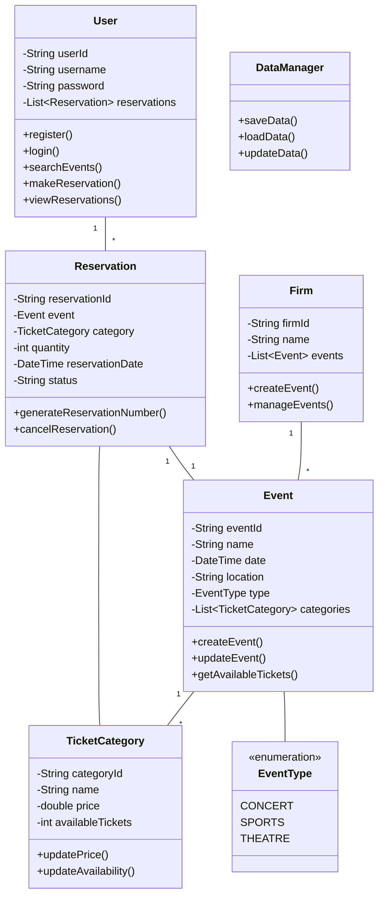

# Online Event Ticket Reservation System

## Project Overview
This is a Java-based online event ticket reservation system that allows users to search, reserve, and track event tickets. The system supports multiple event types and ticket categories, with features for both firms and users.

## Features
- **Firm Operations**
  - Create new events with details (name, date, location)
  - Define ticket categories (VIP, Regular)
  - Set prices per category
  - Manage ticket availability

- **User Operations**
  - Search tickets by time interval
  - View event details (date, location, prices, availability)
  - Make reservations (with or without account)
  - Track reservations using unique numbers
  - View reservation history (for registered users)

- **Data Persistence**
  - All data is stored persistently using files
  - Supports users, events, and reservations data

## Class Diagram

## Project Structure
- `src/main/java/com/ticketsystem`
  - `model/` - Contains all entity classes
  - `service/` - Business logic and services
  - `repository/` - Data persistence layer
  - `util/` - Utility classes
  - `exception/` - Custom exceptions

## Getting Started
1. Clone the repository
2. Open the project in Eclipse
3. Build and run the application

## Dependencies
- Java 17 or higher
- Eclipse IDE 