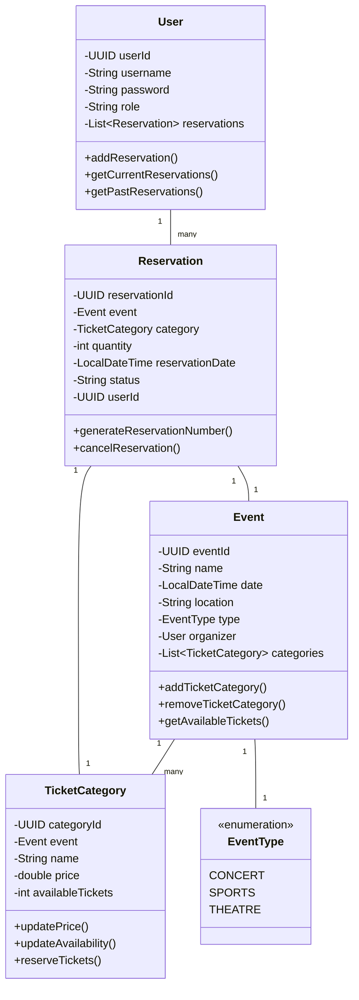

# Online Event Ticket Reservation System - Project Report

## Team Contributions Table

| Team Member | Contribution |
|-------------|--------------|
| Barış Yenigül | Implemented Firm Operations including event creation, ticket category management, and event type handling |
| Ahmet Can Karataş | Implemented User Operations including ticket search, reservation system, and user account management |
| Erhan Alasar | Implemented Data Persistence using PostgreSQL database with repository pattern |

## Usage Scenarios

### Scenario 1: Creating a New Event
1. A firm representative logs into the system
2. Navigates to the event creation section
3. Enters event details:
   - Event name: "Summer Concert 2024"
   - Date: June 15, 2024
   - Location: "Central Park"
   - Type: Concert
4. Creates ticket categories:
   - VIP: $200 (100 tickets)
   - Regular: $100 (500 tickets)
5. System confirms event creation and displays event ID

### Scenario 2: Searching and Reserving Tickets
1. User searches for events between June 1-30, 2024
2. System displays available events with details
3. User selects "Summer Concert 2024"
4. Views available ticket categories and prices
5. Selects 2 Regular tickets
6. System generates a unique reservation number
7. User receives confirmation with reservation details

### Scenario 3: Managing User Reservations
1. User logs into their account
2. Navigates to "My Reservations"
3. Views current and past reservations
4. Can cancel active reservations
5. System updates ticket availability automatically

## UML Class Diagram



## Explanation of Inheritance

The system implements inheritance through the repository pattern:

1. `IRepository<T, ID>` Interface
   - Base interface defining common CRUD operations
   - Generic type parameters for entity type and ID type
   - Implemented by all specific repositories

2. Specialized Repository Interfaces
   - `IEventRepository`: Extends `IRepository` with event-specific queries
   - `IUserRepository`: Extends `IRepository` with user-specific queries
   - `IReservationRepository`: Extends `IRepository` with reservation-specific queries
   - `ITicketCategoryRepository`: Extends `IRepository` with ticket category-specific queries

This inheritance hierarchy allows for:
- Code reuse across repositories
- Consistent CRUD operations
- Type-safe implementations
- Easy extension for new repository types

## Explanation of Polymorphism

Polymorphism is applied in several areas:

1. Repository Pattern
   - All repositories implement the `IRepository` interface
   - Different implementations can be swapped without changing client code
   - Example: `UserRepository` implements `IUserRepository`

2. Event Types
   - `EventType` enum allows for different event categories
   - System can handle different event types uniformly
   - Easy to add new event types without changing existing code

3. Reservation Status
   - Different reservation statuses (CONFIRMED, CANCELLED) are handled polymorphically
   - Status changes trigger appropriate business logic
   - System can be extended with new status types

Benefits:
- Flexible and extensible code
- Reduced coupling between components
- Easy maintenance and updates
- Consistent behavior across different implementations

## Explanation of Data Persistence

The system uses PostgreSQL database for data persistence with the following implementation:

1. Database Structure
   - Tables: users, events, ticket_categories, reservations
   - Relationships maintained through foreign keys
   - Proper indexing for performance

2. Repository Pattern Implementation
   - Each entity has its own repository class
   - Repositories handle all database operations
   - Connection management and transaction handling

3. Data Operations
   - CRUD operations for all entities
   - Complex queries for business operations
   - Transaction management for data integrity

4. Key Features
   - Connection pooling for performance
   - Prepared statements for security
   - Error handling and logging
   - Transaction management for data consistency

Example of data persistence in `UserRepository`:
```java
public void save(User obj) {
    String sql = "INSERT INTO users (user_id, username, password, role) VALUES (?,?,?,?)";
    try (PreparedStatement stmt = connection.prepareStatement(sql)) {
        stmt.setObject(1, obj.getUserId());
        stmt.setString(2, obj.getUsername());
        stmt.setString(3, obj.getPassword());
        stmt.setString(4, obj.getRole());
        stmt.executeUpdate();
    } catch (SQLException e) {
        throw new RuntimeException(e);
    }
}
``` 
