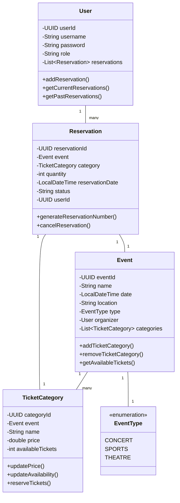

# Online Event Ticket Reservation System - Project Report

## Team Contributions Table

| Team Member | Contribution |
|-------------|--------------|
| Barış Yenigül | Implemented Firm Operations including event creation, ticket category management, and event type handling |
| Ahmet Can Karataş | Implemented User Operations including ticket search, reservation system, and user account management |
| Erhan Alasar | Implemented Data Persistence using PostgreSQL database with repository pattern |

## Usage Scenarios

### Scenario 1: Creating a New Event
1. A firm representative logs into the system
2. Navigates to the event creation section
3. Enters event details:
   - Event name: "Drake Concert"
   - Date: August 12, 2025
   - Location: "Los Angeles CA, USA"
   - Type: Concert
4. Creates ticket categories:
   - VIP: $300.99 (150 tickets)
   - Regular: $100.99 (500 tickets)
5. System confirms event creation and displays event ID


### Scenario 2: Searching and Reserving Tickets
1. User searches for events between July 7- August 29, 2025
2. System displays available events with details
3. User selects "Drake Concert"
4. Views available ticket categories and prices
5. Selects 10 Regular tickets
6. System generates a unique reservation number
7. User receives confirmation with reservation details


### Scenario 3: Managing User Reservations
1. User logs into their account
2. Views current and past reservations
3. System updates ticket availability automatically


## UML Class Diagram



## Explanation of Inheritance

The system implements inheritance through the repository pattern:

1. `IRepository<T, ID>` Interface
   - Base interface defining common CRUD operations
   - Generic type parameters for entity type and ID type
   - Implemented by all specific repositories

2. Specialized Repository Interfaces
   - `IEventRepository`: Extends `IRepository` with event-specific queries
   - `IUserRepository`: Extends `IRepository` with user-specific queries
   - `IReservationRepository`: Extends `IRepository` with reservation-specific queries
   - `ITicketCategoryRepository`: Extends `IRepository` with ticket category-specific queries

Example of a specialized repository interface:
```java
public interface IEventRepository<T, ID> extends IRepository<T, ID> {
    List<T> findEventsByTimeInterval(LocalDateTime startDate, LocalDateTime endDate);
    List<T> findEventsByOrganizer(UUID organizerId);
}
```

This inheritance hierarchy allows for:
- Code reuse across repositories
- Consistent CRUD operations
- Type-safe implementations
- Easy extension for new repository types

## Explanation of Polymorphism

Polymorphism is applied in several areas:

1. Repository Pattern
   - All repositories implement the `IRepository` interface
   - Different implementations can be swapped without changing client code
   - Example: `UserRepository` implements `IUserRepository`

2. Event Types
   - `EventType` enum allows for different event categories
   - System can handle different event types uniformly
   - Easy to add new event types without changing existing code


Benefits:
- Flexible and extensible code
- Reduced coupling between components
- Easy maintenance and updates

## Explanation of Data Persistence

The system uses PostgreSQL database for data persistence with the following implementation:

1. Database Structure
   - Tables: users, events, ticket_categories, reservations
   - Relationships maintained through foreign keys

2. Repository Pattern Implementation
   - Each entity has its own repository class
   - Repositories handle all database operations

3. Data Operations
   - CRUD operations for all entities


Example of transaction management:
```java
public void save(Reservation obj) {
    String sql = "INSERT INTO reservations (reservation_id, event_id, category_id, quantity, reservation_date, status, user_id) VALUES (?, ?, ?, ?, ?, ?, ?)";
    try {
        connection.setAutoCommit(false);  // Start transaction
        try (PreparedStatement stmt = connection.prepareStatement(sql)) {
            // Set parameters and execute
            stmt.executeUpdate();
            connection.commit();  // Commit transaction
        }
    } catch (SQLException e) {
        try {
            connection.rollback();  // Rollback on error
        } catch (SQLException ex) {
            ex.printStackTrace();
        }
    }
}
``` 
