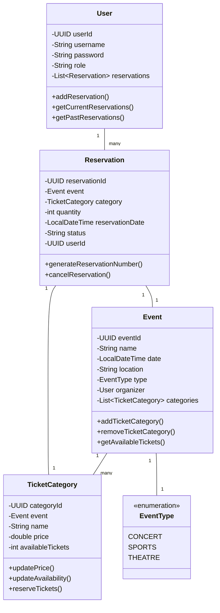

# Online Event Ticket Reservation System - Project Report

## Team Contributions Table

| Team Member | Contribution |
|-------------|--------------|
| Barış Yenigül | Implemented Firm Operations including event creation, ticket category management, and event type handling |
| Ahmet Can Karataş | Implemented User Operations including ticket search, reservation system, and user account management |
| Erhan Alasar | Implemented Data Persistence using PostgreSQL database with repository pattern |

## Usage Scenarios

### Scenario 1: Creating a New Event
1. A firm representative logs into the system
2. Navigates to the event creation section
3. Enters event details:
   - Event name: "Summer Concert 2024"
   - Date: June 15, 2024
   - Location: "Central Park"
   - Type: Concert
4. Creates ticket categories:
   - VIP: $200 (100 tickets)
   - Regular: $100 (500 tickets)
5. System confirms event creation and displays event ID

### Scenario 2: Searching and Reserving Tickets
1. User searches for events between June 1-30, 2024
2. System displays available events with details
3. User selects "Summer Concert 2024"
4. Views available ticket categories and prices
5. Selects 2 Regular tickets
6. System generates a unique reservation number
7. User receives confirmation with reservation details

### Scenario 3: Managing User Reservations
1. User logs into their account
2. Navigates to "My Reservations"
3. Views current and past reservations
4. Can cancel active reservations
5. System updates ticket availability automatically

## UML Class Diagram



## Explanation of Inheritance

The system implements inheritance through the repository pattern:

1. `IRepository<T, ID>` Interface
   - Base interface defining common CRUD operations
   - Generic type parameters for entity type and ID type
   - Implemented by all specific repositories

```java
public interface IRepository<T, ID> {
    void save(T obj);
    Optional<T> findById(ID id);
    List<T> findAll();
    void deleteById(ID id);
    void update(ID id, T newObj);
}
```

2. Specialized Repository Interfaces
   - `IEventRepository`: Extends `IRepository` with event-specific queries
   - `IUserRepository`: Extends `IRepository` with user-specific queries
   - `IReservationRepository`: Extends `IRepository` with reservation-specific queries
   - `ITicketCategoryRepository`: Extends `IRepository` with ticket category-specific queries

Example of a specialized repository interface:
```java
public interface IEventRepository<T, ID> extends IRepository<T, ID> {
    List<T> findEventsByTimeInterval(LocalDateTime startDate, LocalDateTime endDate);
    List<T> findEventsByOrganizer(UUID organizerId);
}
```

This inheritance hierarchy allows for:
- Code reuse across repositories
- Consistent CRUD operations
- Type-safe implementations
- Easy extension for new repository types

## Explanation of Polymorphism

Polymorphism is applied in several areas:

1. Repository Pattern
   - All repositories implement the `IRepository` interface
   - Different implementations can be swapped without changing client code
   - Example: `UserRepository` implements `IUserRepository`

```java
// Base interface
public interface IRepository<T, ID> {
    void save(T obj);
    Optional<T> findById(ID id);
    List<T> findAll();
}

// Specialized interface
public interface IUserRepository<T, ID> extends IRepository<T, ID> {
    Optional<T> findByUsername(String username);
}

// Implementation
public class UserRepository implements IUserRepository<User, UUID> {
    @Override
    public Optional<User> findByUsername(String username) {
        String sql = "SELECT * FROM users WHERE username = ?";
        try (PreparedStatement stmt = connection.prepareStatement(sql)) {
            stmt.setString(1, username);
            ResultSet rs = stmt.executeQuery();
            if (rs.next()) {
                return Optional.of(new User(
                    rs.getObject("user_id", UUID.class),
                    username,
                    rs.getString("password"),
                    rs.getString("role")
                ));
            }
        }
        return Optional.empty();
    }
}
```

2. Event Types
   - `EventType` enum allows for different event categories
   - System can handle different event types uniformly
   - Easy to add new event types without changing existing code

```java
public enum EventType {
    CONCERT,
    SPORTS,
    THEATRE
}

// Usage in Event class
public class Event {
    private EventType type;
    
    public boolean isConcert() {
        return type == EventType.CONCERT;
    }
    
    public boolean isSports() {
        return type == EventType.SPORTS;
    }
    
    public double calculateBasePrice() {
        return switch (type) {
            case CONCERT -> 100.0;
            case SPORTS -> 80.0;
            case THEATRE -> 60.0;
        };
    }
}
```

3. Reservation Status
   - Different reservation statuses are handled polymorphically
   - Status changes trigger appropriate business logic
   - System can be extended with new status types

```java
public class Reservation {
    private String status;
    
    public boolean cancelReservation() {
        if ("CANCELLED".equals(status)) {
            return false;
        }
        status = "CANCELLED";
        category.updateAvailability(category.getAvailableTickets() + quantity);
        return true;
    }
    
    public boolean isActive() {
        return "CONFIRMED".equals(status);
    }
    
    public boolean isCancelled() {
        return "CANCELLED".equals(status);
    }
}
```

4. Ticket Category Management
   - Different ticket categories can be handled uniformly
   - Price calculations and availability checks are polymorphic

```java
public class TicketCategory {
    private String name;
    private double price;
    private int availableTickets;
    
    public boolean reserveTickets(int quantity) {
        if (quantity <= 0) {
            throw new IllegalArgumentException("Quantity must be positive");
        }
        if (quantity > availableTickets) {
            return false;
        }
        availableTickets -= quantity;
        return true;
    }
    
    public double calculateTotalPrice(int quantity) {
        return price * quantity;
    }
}
```

Benefits:
- Flexible and extensible code
- Reduced coupling between components
- Easy maintenance and updates
- Consistent behavior across different implementations

## Explanation of Data Persistence

The system uses PostgreSQL database for data persistence with the following implementation:

1. Database Structure
   - Tables: users, events, ticket_categories, reservations
   - Relationships maintained through foreign keys
   - Proper indexing for performance

2. Repository Pattern Implementation
   - Each entity has its own repository class
   - Repositories handle all database operations
   - Connection management and transaction handling

Example of a repository implementation:
```java
public class EventRepository implements IEventRepository<Event, UUID> {
    private final Connection connection;
    private final UserRepository userRepository;

    public EventRepository(Connection connection, UserRepository userRepository) {
        this.connection = connection;
        this.userRepository = userRepository;
    }

    @Override
    public void save(Event obj) {
        String sql = "INSERT INTO events (event_id, name, event_date, location, organizer_id, event_type) VALUES (?, ?, ?, ?, ?, ?)";
        try {
            connection.setAutoCommit(false);
            try (PreparedStatement stmt = connection.prepareStatement(sql)) {
                stmt.setObject(1, obj.getEventId());
                stmt.setString(2, obj.getName());
                stmt.setTimestamp(3, Timestamp.valueOf(obj.getDate()));
                stmt.setString(4, obj.getLocation());
                stmt.setObject(5, obj.getOrganizer().getUserId());
                stmt.setString(6, obj.getType().name());
                stmt.executeUpdate();
                connection.commit();
            }
        } catch (SQLException e) {
            e.printStackTrace();
        }
    }
}
```

3. Data Operations
   - CRUD operations for all entities
   - Complex queries for business operations
   - Transaction management for data integrity

Example of a complex query:
```java
public List<Event> findEventsByTimeInterval(LocalDateTime startDate, LocalDateTime endDate) {
    List<Event> events = new ArrayList<>();
    String sql = "SELECT * FROM events WHERE event_date >= ? AND event_date <= ?";
    try (PreparedStatement stmt = connection.prepareStatement(sql)) {
        stmt.setTimestamp(1, Timestamp.valueOf(startDate));
        stmt.setTimestamp(2, Timestamp.valueOf(endDate));
        ResultSet rs = stmt.executeQuery();
        // Process results...
    }
    return events;
}
```

4. Key Features
   - Connection pooling for performance
   - Prepared statements for security
   - Error handling and logging
   - Transaction management for data consistency

Example of transaction management:
```java
public void save(Reservation obj) {
    String sql = "INSERT INTO reservations (reservation_id, event_id, category_id, quantity, reservation_date, status, user_id) VALUES (?, ?, ?, ?, ?, ?, ?)";
    try {
        connection.setAutoCommit(false);  // Start transaction
        try (PreparedStatement stmt = connection.prepareStatement(sql)) {
            // Set parameters and execute
            stmt.executeUpdate();
            connection.commit();  // Commit transaction
        }
    } catch (SQLException e) {
        try {
            connection.rollback();  // Rollback on error
        } catch (SQLException ex) {
            ex.printStackTrace();
        }
    }
}
``` 
